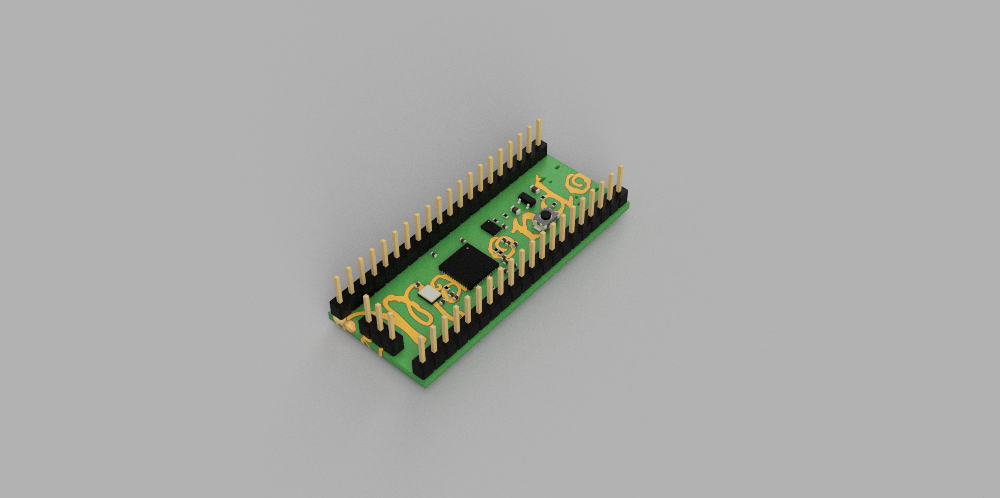
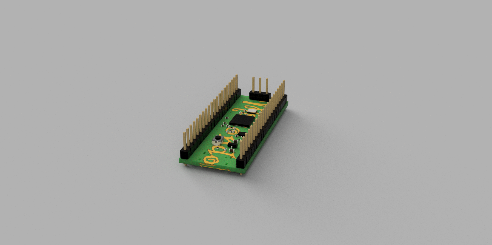

# My RP2040 Dev Board

A simple RP2040 development board designed to help me learn PCB design and gain experience creating custom hardware.

## Features
- RP2040 microcontroller
- USB-C for power and programming
- BOOT and RESET buttons
- Status LED
- Broken out GPIO pins
- SWD debugging header
- Designed in KiCad

## Renders

### Front


### Back


## Project Structure

```
PCB/        - KiCad project files
Renders/    - PCB renders
```

## Goals

This project was made to:
- Learn the PCB design workflow
- Practice schematic capture and PCB layout
- Understand RP2040 hardware design
- Gain experience preparing boards for manufacturing

## Software

Designed using **KiCad**.

## License

This project is open source under the MIT License.